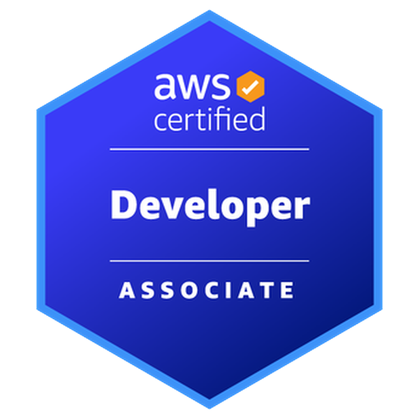
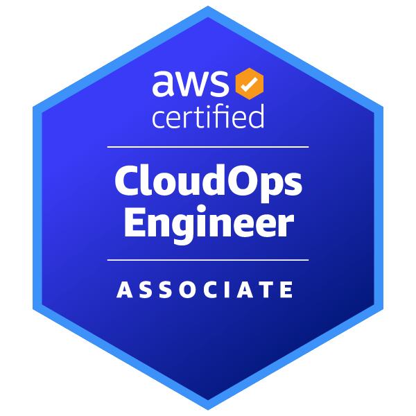
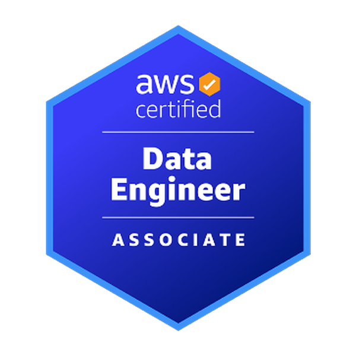
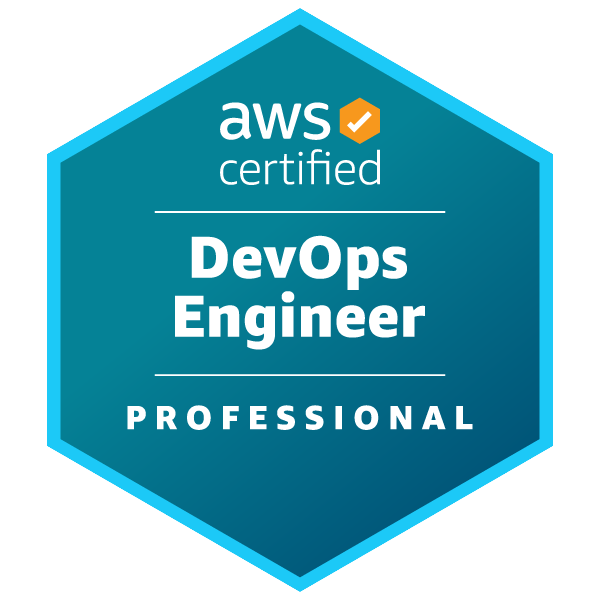
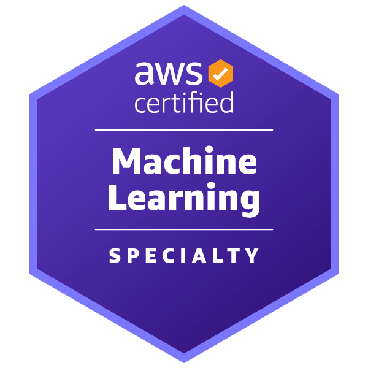

<!-- Header -->

  

  
  
  

---

# 👋 About Me

Cloud & DevOps engineer focused on **AI infrastructure, platform engineering, and scalable cloud systems**.

I design infrastructure that enables engineering teams to build and deploy systems quickly while keeping platforms **secure, observable, and reliable**.

Areas I spend most of my time in:

- AI infrastructure and inference platforms  
- CI/CD architecture at scale  
- platform engineering and developer tooling  
- AWS cloud architecture  

---

# 🛠 Tech Stack

---

# 🎓 Certifications
## 🎓 Certifications

  <table>
  <tr>
  <td align="center" width="220">
        

          
        

      </td>

  <td align="center" width="220">
        

          
        

      </td>

  <td align="center" width="220">
        

          
        

      </td>

  <td align="center" width="220">
        

          
        

      </td>

  <td align="center" width="220">
        

          
        

      </td>
    </tr>

  <tr>
      <td></td>

  <td align="center" width="220">
        

          
        

      </td>

  <td align="center" width="220">
        

          
        

      </td>

  <td align="center" width="220">
        

          
        

      </td>

  <td></td>
  </tr>
  </table>

---

# 🌍 Communities

<table>

<tr>

<td align="center" valign="top" width="260" style="padding:20px 10px; line-height:1.4;">
  
   
  <b>AWS User Group</b> 
  Israel
</td>

<td align="center" valign="top" width="260" style="padding:20px 10px; line-height:1.4;">
  
   
  <b>GitHub User Group</b> 
  Israel
</td>

</tr>

</table>

---

# 📊 GitHub Stats

---

